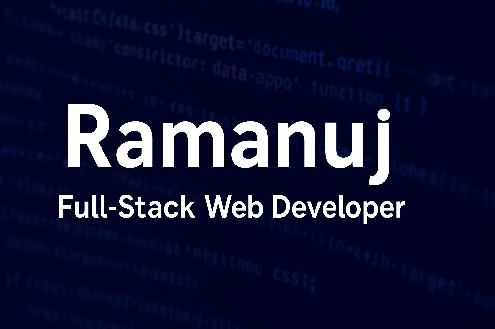

# Hi there 👋, I'm Ramanuj Puspant Bharti

**MERN-Stack Web Developer | Streamlit Python developer | Wordpress Developer**  
India

  

---

  

---

## 🛠 Skills

**Programming Languages:**  
 

**Frontend:**  
 
 
 
 

**Backend:**  
 
  

**Databases:**  
 
  

**Libraries / Tools:**  
 
 
 
  

**Version Control:**  
 
  

---

## 💼 Experience

**Open Source Contributor** – VS Code Marketplace & GitHub (Jul 2025 – Present)  
- Developed a custom VS Code extension for JSP with syntax highlighting, IntelliSense, and optional live preview via Apache Tomcat.  
- Contributed to **35+ forked GitHub repositories**, improving documentation, fixing issues, and adding features to open-source projects.  

---

## 🚀 Projects

**[RoboLearn](https://robolearn.onrender.com/)** – Full-Stack Development (Nov 2024 – Jan 2025)  
- Built an interactive platform combining **AI and Robotics** for self-learning robots using Reinforcement Learning.  
- Developed **AI Road-map Web App** using LLMs (GROK API) for personalized learning paths.  
- Tools: HTML, CSS, JS, Express, MongoDB, JWT  

**[Bank Management System](https://banking-system-oops-sckagy2ecucvzcfbtqxxfs.streamlit.app/)** – Streamlit + Python OOP (Nov 2024 – Jan 2025)  
- OOP-based banking system with account creation, deposits, withdrawals, and transaction history.  
- Integrated Pandas, CSV storage, and Streamlit charts for visualizing account performance.  
- Tools: Python, Streamlit, NumPy, Pandas, Matplotlib, CSV  

---

## 🌱 Currently Learning / Fun Projects

 
 
  
- Learning **Docker & Kubernetes** for containerized deployments  
- Experimenting with **real-time web apps** using WebSockets  

---

## 🏆 Achievements

- **CodeChef 2★ Coder** – Ranking: 1458  
  

- **Smart India Hackathon** – Barber delivery website project  
[Link](https://trimtokyo4.onrender.com/)  

- **Hacktoberfest 2025** – Super Contributor (6 PRs to open-source projects)  
  

---

## 📫 Contact Me

[Email](mailto:ramanujbharti287@gmail.com) | [LinkedIn](https://www.linkedin.com/in/ramanuj-bharti-b85082339/) | [Portfolio](https://portfolio-taupe-six-80.vercel.app)

---

## 📊 GitHub Stats

